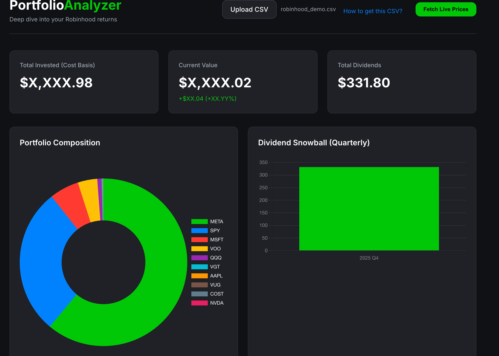

# Robinhood Portfolio Analyzer

A privacy-focused, local dashboard to visualize and analyze your Robinhood portfolio performance, backed by a robust Python server for unlimited financial data.



## Features

- **🔒 Private & Local**: Your CSV data is processed entirely in your browser. It is never sent to any server.
- **📈 Unlimited History**: Uses a local Python backend (`yfinance`) to fetch unlimited historical price data without API limits.
- **📅 Vintage Analysis**: Visualizes your performance based on the year you invested (FIFO method).
- **🆚 Benchmark Simulation**: Simulates "what if" scenarios (e.g., "What if I bought SPY instead?") using your exact deposit dates.

## Quick Start

This project uses [`uv`](https://github.com/astral-sh/uv) for fast and reliable dependency management.

1. **Run the Server**:
   ```bash
   uv run server.py
   ```
   *(This will automatically install `flask` and `yfinance` in a virtual environment)*

2. **Open the App**:
   Navigate to [http://localhost:5000](http://localhost:5000)

3. **Analyze**:
   - Upload your Robinhood CSV file.
   - Click "Fetch Live Prices" to see current values.
